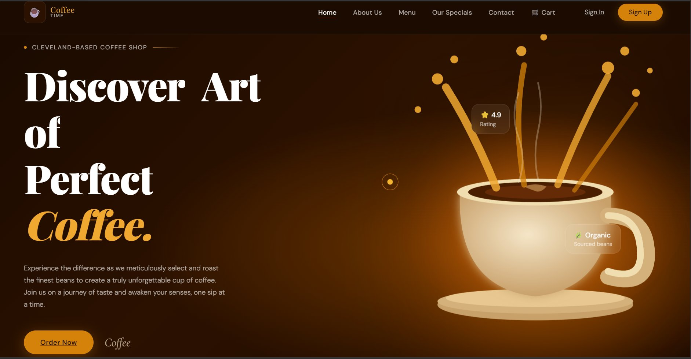
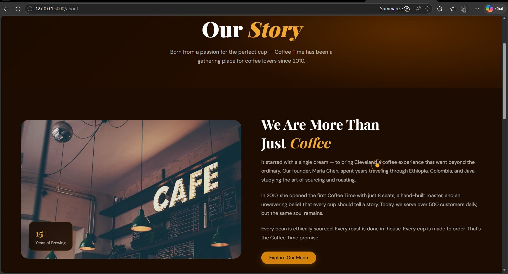
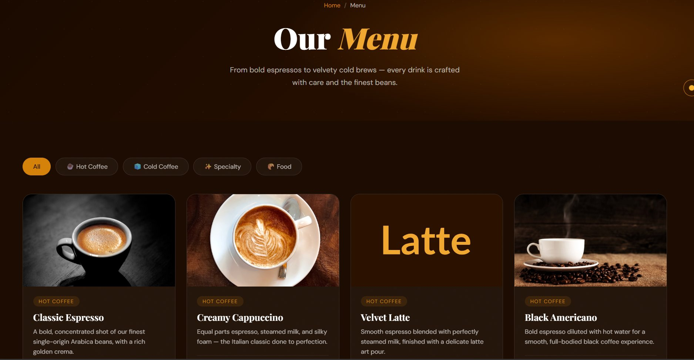
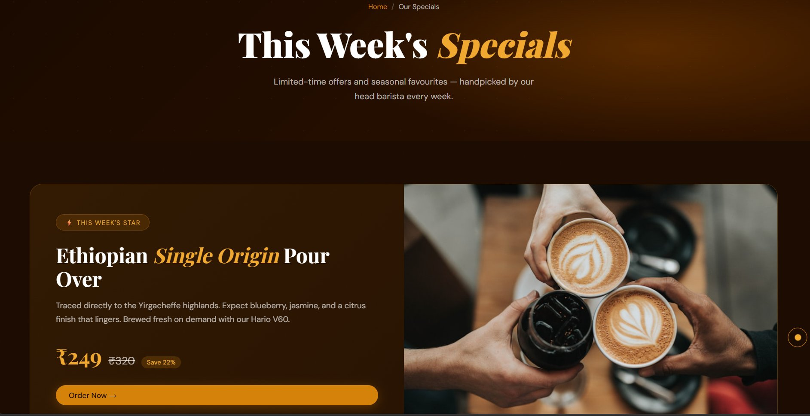
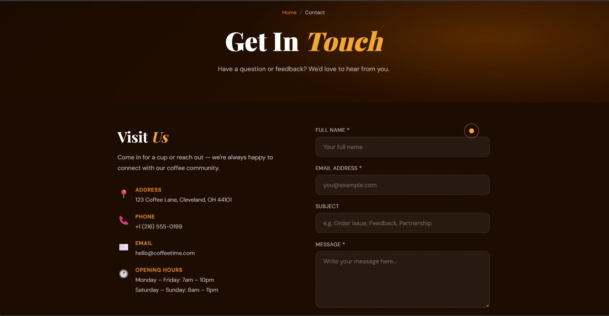
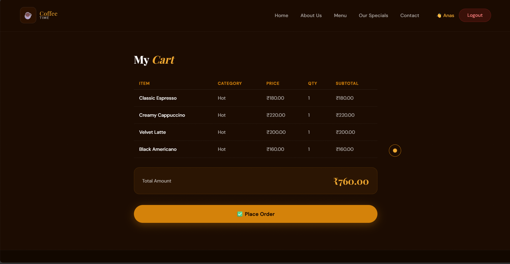
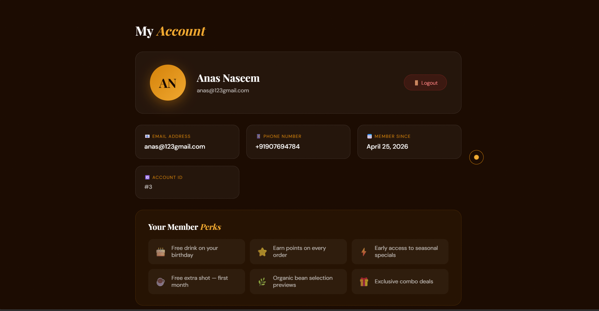
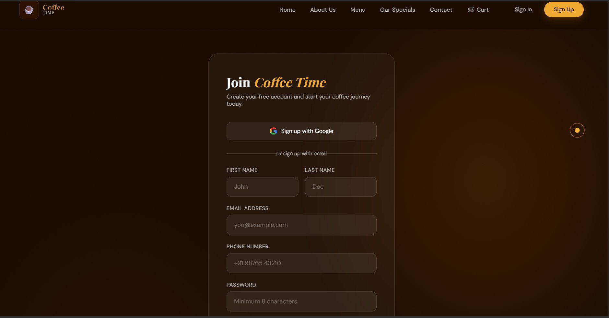
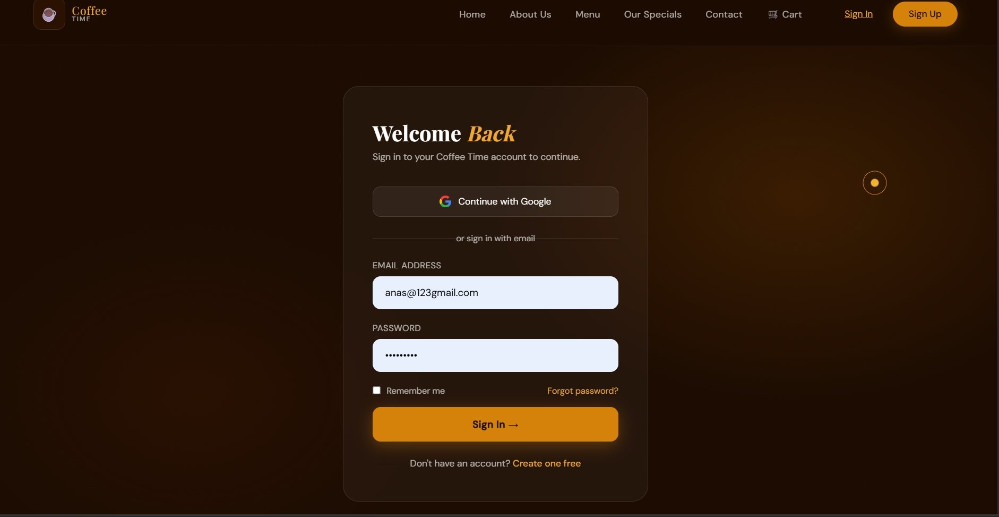

# coffee-time-fullstack
Modern full-stack cafe website using Flask + PostgreSQL with authentication and ordering system.

# ☕ Coffee Time – Full Stack Cafe Website

A modern and stylish full-stack cafe/restaurant website built using **Flask**, **PostgreSQL**, **HTML**, **CSS**, and **JavaScript**.

This project includes a complete frontend design with multiple pages and a backend system for authentication, orders, account management, cart functionality, and contact form integration.

Built for learning full-stack development and real-world restaurant website structure.

---
## 🖥️ Screenshots

### 🏠 Home Page


### 📖 About Us


### ☕ Menu


### ⭐ Specials


### 📞 Contact


### 🛒 Cart


### 👤 Account


### 📝 Sign Up


### 🔐 Sign In


## 🚀 Features

### Frontend Pages
- 🏠 Home Page
- 📖 About Page
- 🍽 Menu Page
- ⭐ Specials Page
- 🛒 Cart Page
- 👤 Account Dashboard
- 🔐 Login System
- 📝 Signup System
- 📩 Contact Page

### Backend Features
- Flask Server
- PostgreSQL Database Integration
- User Authentication
- Password Hashing
- Session Management
- Order Storage
- Contact Form Database Save
- Login Required Routes
- User Account Handling

---

## 🛠 Tech Stack

### Frontend
- HTML5
- CSS3
- JavaScript

### Backend
- Python
- Flask
- PostgreSQL
- psycopg2
- Werkzeug Security

---

## 📂 Project Structure

```bash
Coffee-Time/
│
├── app.py
├── index.html
├── about.html
├── menu.html
├── specials.html
├── login.html
├── signup.html
├── account.html
├── cart.html
├── contact.html
├── .gitignore
├── requirements.txt
└── README.md
